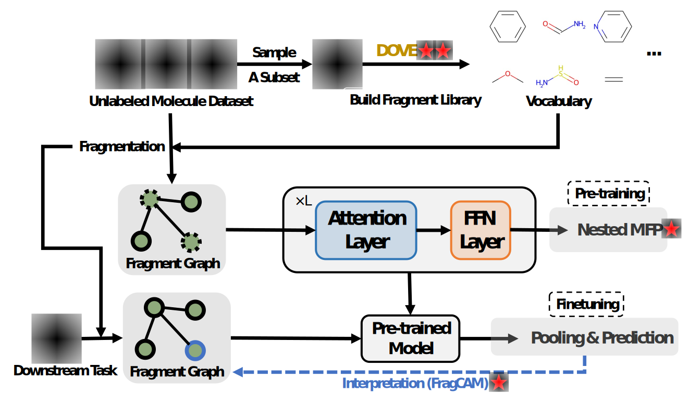

# FragFormer: A Fragment-Based Representation Learning Framework for Molecular Property Prediction



```bash
pip install -e .
```
### Construct Fragment Library with DOVE

```bash
cd fragment_mol
python learn_vocab.py
```

### Pre-training Stage 

```bash
cd ..
cd fragformer
bash train.sh
```
### Fine-tuning Stage

```bash
bash finetune.sh
```


Still refining the repo...